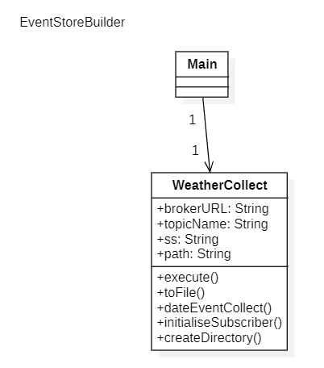

# WeatherAppEvent
 
### Subject:
Data Science Application Development - Second Year
### Degree:
Data Science and Engineering
### School:
Mathematics and Informatics
### University: 
Las Palmas de Gran Canaria

## Description
This project is an application that allows you to collect future weather forecasts using an API and then send them to a broker to be picked up by another module of the application. The predictions we collect will be only from 12:00 pm and will be collected for the next 5 days. 

## Modules
The application is divided into two modules, the first one is the one that collects the data from an API and the second one is the one that receives and stores them in a directory that is created by putting the name of the topic that is going to be created in the broker, then the API that we use to collect the data and finally a file is created if it does not exist for each day that events are received.

### Module 1 - PredictionProvider
This module is the one that collects the data from the API and sends it to the broker, it is divided into two parts, the first one is the one that collects the data and the second one is the one that sends it to the broker.
#### Structure
The structure of the module is as follows:
```
PredictionProvider
├───src
│   ├───main
│   │   ├───java
│   │   │   └───org
│   │   │       └───ulpgc
│   │   │           └───dacd
│   │   │                └─── PredictionProvider.java
│   │   │                       └─── Main.java
│   │   │                       └─── OpenWeatherMapProvider.java
│   │   │                       └─── JmsWeatherStore.java
│   │   │                       └─── WeatherStore.java
│   │   │                       └─── WeatherProvider.java
│   │   │                       └─── WeatherController.java
│   │   │                       └─── Task.java
│   │   │                       └─── InstantTypeAdapter.java
│   │   │               └───model
│   │   │                   └─── Weather.java
│   │   │                   └─── Location.java
│   │   │               └───exceptions
│   │   │                   └─── ConnectionException.java
│   │   │                   └─── URLInvalidException.java
│   │   │                   └─── JmsException.java
│   │   │           └───resources
│   │   │               └─── locations.csv
```
#### Classes Control
The classes that make up the module are the following:
- **Main:** This class is the one that starts the application, it is in charge of creating the instance of the controller and starting the application.
- **WeatherProvider:** This interface is the one that defines the methods that the provider must implement.
- **WeatherStore:** This interface is the one that defines the methods that the store must implement.
- **WeatherController:** This class is the one that controls the application, which has all the execution of this module that is made has as attributes other classes in charge of the collection of the information of the APIS and then the creation of the topic and the sending of events to the broker.
- **OpenWeatherMapProvider:** This class is the one that collects the data from the API, it is in charge of making the connection to the API.
- **JmsWeatherStore:** This class is the one that sends the events to the broker, it is in charge of creating the topic and sending the events to the broker.
- **Task:** This class controls the periodicity of the application.
- **InstantTypeAdapter:** This class is the one that converts the date to the format that the broker accepts.

#### Classes Model
The classes that make up the model are the following:
- **Weather:** This class is the one that defines the structure of the events that are going to be sent to the broker.
- **Location:** This class is the one that defines the structure of the locations that are going to be used to collect the data from the API.

#### Classes Exceptions
The classes that make up the exceptions are the following:
- **ConnectionException:** This class is the one that defines the exception that is thrown when there is a connection error.
- **URLInvalidException:** This class is the one that defines the exception that is thrown when the URL is invalid.
- **JmsExceptionConection:** This class is the one that defines the exception that is thrown when there is an error with the broker.

#### Resources
The resources that make up the module are the following:
- **locations.csv:** This file is the one that contains the locations that are going to be used to collect the data from the API.

#### Class Diagram


### Module 2 - EventStoreBuilder
This module is the one that receives the events from the broker and stores them in a directory, it is divided into two parts, the first one is the one that receives the events and the second one is the one that stores them in a directory.
#### Structure
The structure of the module is as follows:
```
EventStoreBuilder
├───src
│   ├───main
│   │   ├───java
│   │   │   └───org
│   │   │       └───ulpgc
│   │   │           └───dacd
│   │   │                └─── control
│   │   │                       └─── Main.java
│   │   │                       └─── WeatherCollect.java
│   │   │                └─── exceptions
│   │   │                       └─── CollectFromBrokerException.java
│   │   │                       └─── CreateDirectoryException.java
│   │   │                       └─── SaveEventFileException.java
```
#### Classes Control
The classes that make up the module are the following:
- **Main:** This class is the one that starts the application, it is in charge of creating the instance of the controller and starting the application.
- **WeatherCollect:** This class is where we create the durable subscriber for the constant collection of events and then store them in a directory that is indicated by arguments, we save the events in files where we indicate year, month and day and we add all the events that are collected on the same day.

#### Classes Exceptions
The classes that make up the exceptions are the following:
- **CollectFromBrokerException:** This class is the one that defines the exception that is thrown when there is an error collecting the events from the broker.
- **CreateDirectoryException:** This class is the one that defines the exception that is thrown when there is an error creating the directory.
- **SaveEventFileException:** This class is the one that defines the exception that is thrown when there is an error saving the events in the file.

#### Class Diagram


## How to use
To use the application first we have to start EventStoreBuilder (Module 2) which is responsible for listening for new broker events and then save them, we must take into account that we have to pass a path to a directory that we want to save our events, then we have to start the PredictionProvider (Module 1) that will be responsible for collecting data from the API in which we have to pass as an argument an apikey and as a second argument the path to the .csv where we have the locations placed.

## Resources used
- [OpenWeatherMap](https://openweathermap.org/api)
- [Gson](https://github.com/google/gson)
- [JMS](https://docs.oracle.com/javaee/7/api/javax/jms/package-summary.html)
- [ActiveMQ](https://activemq.apache.org/)
- [Java](https://www.java.com/es/)
- [IntelliJ IDEA](https://www.jetbrains.com/es-es/idea/)
- [Git](https://git-scm.com/)
- [GitHub](https://github.com/)
- [Markdown](https://www.markdownguide.org/)
- [CSV](https://es.wikipedia.org/wiki/Valores_separados_por_comas)
